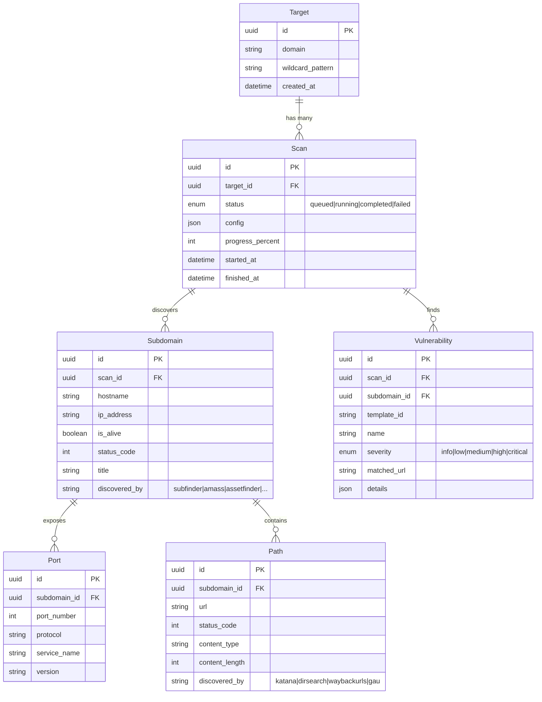

# 🛡️ BG-Scanner — Bug Bounty Reconnaissance & Dashboard

> **목적**: 대상 도메인(예: `*.target.com`)을 입력하면 자동으로 공격 표면(Attack Surface)을 수집·분석하고, 웹 대시보드에서 결과를 실시간으로 관제할 수 있는 올인원 버그바운티 스캐너

---

## 1. 시스템 아키텍처 개요

```
┌──────────────────────────────────────────────────────────────────────┐
│                         Web Dashboard (Frontend)                     │
│                    React + Vite · TanStack Query · Recharts          │
│          실시간 결과 조회 · 스캔 제어 · 리포트 뷰어 · 알림           │
└──────────────────────┬───────────────────────────────────────────────┘
                       │  REST API + WebSocket (실시간 이벤트)
┌──────────────────────▼───────────────────────────────────────────────┐
│                        API Server (Backend)                          │
│               Python · FastAPI · SQLAlchemy · Alembic                │
│         인증 · 스캔 오케스트레이션 · 결과 CRUD · WebSocket           │
└──────┬─────────────┬──────────────┬──────────────┬───────────────────┘
       │             │              │              │
  ┌────▼────┐  ┌─────▼─────┐  ┌────▼────┐  ┌─────▼─────┐
  │ Scanner │  │  Scanner   │  │ Scanner │  │  Scanner   │
  │ Module  │  │  Module    │  │ Module  │  │  Module    │
  │Subdomain│  │   Port     │  │  Path   │  │  Nuclei    │
  │  Enum   │  │   Scan     │  │  Crawl  │  │ Vuln Scan  │
  │(5 tools)│  │  (Nmap)    │  │(4 tools)│  │            │
  └────┬────┘  └─────┬─────┘  └────┬────┘  └─────┬─────┘
       │             │              │              │
  ┌────▼─────────────▼──────────────▼──────────────▼───────────────────┐
  │                   Task Queue (Celery + Redis)                       │
  │             작업 스케줄링 · 재시도 · 동시성 제어 · 진행률           │
  └────────────────────────────┬───────────────────────────────────────┘
                               │
  ┌────────────────────────────▼───────────────────────────────────────┐
  │                     Database (PostgreSQL)                           │
  │   targets · scans · subdomains · ports · paths · vulnerabilities   │
  └────────────────────────────────────────────────────────────────────┘
```

### Docker Compose 서비스 구성

```
docker compose up -d  ← 원커맨드로 전체 실행

  ┌───────────┐  ┌───────────┐  ┌───────────┐  ┌───────────┐  ┌───────────┐
  │ frontend  │  │  backend   │  │  worker    │  │ postgres  │  │   redis   │
  │ (Nginx +  │  │ (FastAPI   │  │ (Celery   │  │           │  │           │
  │  React)   │  │  Uvicorn)  │  │  Worker)  │  │           │  │           │
  │ :3000     │  │ :8000      │  │           │  │ :5432     │  │ :6379     │
  └───────────┘  └───────────┘  └───────────┘  └───────────┘  └───────────┘
       │               │              │              │              │
       └───────────────┼──────────────┼──────────────┼──────────────┘
                       └──── Docker Network (bg-scanner-net) ────┘
```

---

## 2. 핵심 워크플로우

```
[사용자 입력: *.target.com]
        │
        ▼
  ① Subdomain Enumeration ──→ sub1.target.com, sub2.target.com ...
  │  (Subfinder + Amass + Assetfinder + Findomain + crt.sh)
  │  → 결과 병합 + 중복 제거 + httpx 라이브 체크
        │
        ▼
  ② Port Scanning ──────────→ sub1:80, sub1:443, sub2:8080 ...
  │  (Nmap SYN/Version scan)
        │
        ▼
  ③ Path Crawling ──────────→ /api/v1, /admin, /login ...
  │  (Katana + dirsearch + waybackurls + gau)
  │  → 결과 병합 + 중복 제거 + 상태코드 필터링
        │
        ▼
  ④ Nuclei Vulnerability ──→ CVE-2024-XXXX, XSS, SQLi ...
  │  (Nuclei official + custom templates)
        │
        ▼
  [Web Dashboard에 실시간 표시]
```

- 각 단계는 **독립된 Celery Worker**로 실행 → 이전 단계 결과가 다음 단계의 입력
- 실패 시 자동 재시도, 부분 결과도 즉시 대시보드에 반영

---

## 3. 기술 스택

| 레이어 | 기술 | 선정 이유 |
|--------|------|-----------|
| **Frontend** | React + Vite | 빠른 HMR, 모던 번들링 |
| **UI 컴포넌트** | shadcn/ui + Tailwind CSS | 일관된 디자인 시스템, 빠른 구축 |
| **차트/시각화** | Recharts + React Flow | 공격 표면 그래프, 통계 차트 |
| **상태관리** | TanStack Query | 서버 상태 캐싱, 실시간 갱신 |
| **Backend** | Python 3.12 + FastAPI | 비동기 고성능, 자동 API 문서, Python 에코시스템 활용 |
| **ORM** | SQLAlchemy 2.0 + Alembic | Python 표준 ORM, 강력한 마이그레이션 |
| **작업 큐** | Celery + Redis | Python 네이티브 분산 작업 처리, 체이닝/그룹 지원 |
| **실시간** | FastAPI WebSocket + redis pub/sub | Celery 워커 → Redis → WebSocket 실시간 전달 |
| **DB** | PostgreSQL 16 | 관계형 데이터, JSON 지원, 성숙한 에코시스템 |
| **컨테이너** | Docker + Docker Compose | 전체 서비스 원커맨드 배포, 도구 격리 |

---

## 4. 디렉터리 구조

```
bg-scanner/
├── docker-compose.yml              # 전체 서비스 오케스트레이션 (5 서비스)
├── .env.example                    # 환경변수 템플릿
│
├── frontend/                       # ── Web Dashboard ──
│   ├── Dockerfile                  # Multi-stage build (build → Nginx)
│   ├── nginx.conf                  # 프론트엔드 서빙 + API 프록시
│   ├── public/
│   ├── src/
│   │   ├── components/             # UI 컴포넌트
│   │   │   ├── layout/             #   Header, Sidebar, Layout
│   │   │   ├── dashboard/          #   DashboardCard, StatsPanel
│   │   │   ├── scan/               #   ScanForm, ScanProgress, ScanHistory
│   │   │   ├── results/            #   SubdomainTable, PortList, VulnCard
│   │   │   └── common/             #   Button, Modal, Badge, DataTable
│   │   ├── pages/                  # 페이지 라우트
│   │   │   ├── DashboardPage       #   메인 관제 대시보드
│   │   │   ├── ScanPage            #   새 스캔 시작
│   │   │   ├── ResultsPage         #   스캔 결과 상세
│   │   │   ├── TargetsPage         #   타겟 관리
│   │   │   ├── ReportPage          #   리포트 생성/조회
│   │   │   └── WorkPage            #   워커 현황 관제 (실행 중, 대기열)
│   │   ├── hooks/                  # 커스텀 훅 (useScans, useWebSocket ...)
│   │   ├── services/               # API 호출 래퍼
│   │   ├── store/                  # 클라이언트 상태 (Zustand)
│   │   ├── types/                  # TypeScript 타입 정의
│   │   └── utils/                  # 유틸리티 함수
│   ├── index.html
│   ├── vite.config.ts
│   ├── tailwind.config.ts
│   └── package.json
│
├── backend/                        # ── Python API Server + Workers ──
│   ├── Dockerfile                  # Python 3.12 + 보안 도구 설치
│   ├── requirements.txt            # Python 의존성
│   ├── alembic.ini                 # Alembic 설정
│   ├── alembic/                    # DB 마이그레이션
│   │   └── versions/
│   │
│   ├── app/
│   │   ├── __init__.py
│   │   ├── main.py                 # FastAPI 앱 엔트리포인트
│   │   ├── config.py               # 환경변수 기반 설정 (Pydantic Settings)
│   │   │
│   │   ├── api/                    # API 라우터
│   │   │   ├── __init__.py
│   │   │   ├── targets.py          #   POST/GET /api/targets
│   │   │   ├── scans.py            #   POST/GET /api/scans
│   │   │   ├── results.py          #   GET /api/results/{scan_id}
│   │   │   ├── reports.py          #   GET/POST /api/reports
│   │   │   └── workers.py          #   GET /api/workers (Celery 상태)
│   │   │
│   │   ├── models/                 # SQLAlchemy 모델
│   │   │   ├── __init__.py
│   │   │   ├── target.py
│   │   │   ├── scan.py
│   │   │   ├── subdomain.py
│   │   │   ├── port.py
│   │   │   ├── path.py
│   │   │   └── vulnerability.py
│   │   │
│   │   ├── schemas/                # Pydantic 스키마 (요청/응답 검증)
│   │   │   ├── __init__.py
│   │   │   ├── target.py
│   │   │   ├── scan.py
│   │   │   └── result.py
│   │   │
│   │   ├── services/               # 비즈니스 로직
│   │   │   ├── __init__.py
│   │   │   ├── scan_service.py
│   │   │   ├── target_service.py
│   │   │   └── report_service.py
│   │   │
│   │   ├── workers/                # Celery 태스크 정의
│   │   │   ├── __init__.py
│   │   │   ├── celery_app.py       #   Celery 인스턴스 설정
│   │   │   ├── subdomain_task.py   #   서브도메인 열거 (5개 도구 병합)
│   │   │   ├── portscan_task.py    #   포트 스캐닝
│   │   │   ├── crawler_task.py     #   경로 크롤링 (4개 도구 병합)
│   │   │   ├── nuclei_task.py      #   취약점 스캔
│   │   │   └── pipeline.py         #   Celery chain/chord 파이프라인 정의
│   │   │
│   │   ├── scanners/               # 외부 도구 래퍼 (subprocess 호출)
│   │   │   ├── __init__.py
│   │   │   ├── base.py             #   BaseTool 추상 클래스
│   │   │   ├── subfinder.py        #   Subfinder 래퍼
│   │   │   ├── amass.py            #   Amass 래퍼
│   │   │   ├── assetfinder.py      #   Assetfinder 래퍼
│   │   │   ├── findomain.py        #   Findomain 래퍼
│   │   │   ├── crtsh.py            #   crt.sh API 래퍼
│   │   │   ├── httpx_probe.py      #   httpx (HTTP 프로빙)
│   │   │   ├── nmap.py             #   Nmap 래퍼
│   │   │   ├── katana.py           #   Katana (크롤러)
│   │   │   ├── dirsearch.py        #   dirsearch (디렉터리 브루트포스)
│   │   │   ├── waybackurls.py      #   Wayback Machine URL 수집
│   │   │   ├── gau.py              #   GetAllUrls (gau)
│   │   │   ├── nuclei.py           #   Nuclei 래퍼
│   │   │   └── result_merger.py    #   다중 도구 결과 병합 + 중복 제거
│   │   │
│   │   ├── websocket/              # 실시간 이벤트 (Redis Pub/Sub → WS)
│   │   │   ├── __init__.py
│   │   │   └── events.py
│   │   │
│   │   ├── middleware/             # 인증, CORS, 에러핸들링, 로깅
│   │   │   └── __init__.py
│   │   │
│   │   ├── db/                     # 데이터베이스 세션 관리
│   │   │   ├── __init__.py
│   │   │   └── session.py
│   │   │
│   │   └── utils/                  # 유틸리티
│   │       └── __init__.py
│   │
│   └── tests/                      # pytest 테스트
│       ├── test_api/
│       ├── test_scanners/
│       └── test_workers/
│
└── docs/                           # ── 문서 ──
    ├── structure.md                # (이 파일)
    ├── api-spec.md                 # API 명세
    └── setup-guide.md              # 설치 가이드
```

---

## 5. Docker Compose 구성

```yaml
# docker-compose.yml (개요)
version: "3.9"

services:
  # ─── 인프라 ───
  postgres:
    image: postgres:16-alpine
    volumes: [ pg_data:/var/lib/postgresql/data ]
    environment:
      POSTGRES_DB: bgscanner
      POSTGRES_USER: bgscanner
      POSTGRES_PASSWORD: ${DB_PASSWORD}
    ports: [ "5432:5432" ]

  redis:
    image: redis:7-alpine
    ports: [ "6379:6379" ]

  # ─── 백엔드 API ───
  backend:
    build: ./backend
    command: uvicorn app.main:app --host 0.0.0.0 --port 8000 --reload
    volumes: [ ./backend:/app ]
    depends_on: [ postgres, redis ]
    environment:
      DATABASE_URL: postgresql+asyncpg://...
      REDIS_URL: redis://redis:6379/0
    ports: [ "8000:8000" ]

  # ─── Celery 워커 (스캐닝 도구 포함) ───
  worker:
    build: ./backend
    command: celery -A app.workers.celery_app worker -l info -c 4
    volumes: [ ./backend:/app ]
    depends_on: [ postgres, redis ]
    environment:
      DATABASE_URL: postgresql://...
      REDIS_URL: redis://redis:6379/0
    # 스캐닝 도구가 모두 이 컨테이너에 설치됨
    # (subfinder, amass, assetfinder, findomain, nmap,
    #  katana, dirsearch, waybackurls, gau, httpx, nuclei)

  # ─── 프론트엔드 ───
  frontend:
    build: ./frontend
    depends_on: [ backend ]
    ports: [ "3000:80" ]
    # Nginx: 정적 파일 서빙 + /api → backend:8000 리버스 프록시

volumes:
  pg_data:

networks:
  default:
    name: bg-scanner-net
```

---

## 6. 데이터 모델 (ERD)



---

## 7. API 엔드포인트 설계

### Targets
| Method | Path | 설명 |
|--------|------|------|
| `POST` | `/api/targets` | 새 타겟 등록 |
| `GET` | `/api/targets` | 타겟 목록 조회 |
| `GET` | `/api/targets/{id}` | 타겟 상세 조회 |
| `DELETE` | `/api/targets/{id}` | 타겟 삭제 |

### Scans
| Method | Path | 설명 |
|--------|------|------|
| `POST` | `/api/scans` | 새 스캔 시작 |
| `GET` | `/api/scans` | 스캔 목록 (필터링/페이징) |
| `GET` | `/api/scans/{id}` | 스캔 상세 + 진행 상태 |
| `POST` | `/api/scans/{id}/stop` | 스캔 중지 |
| `POST` | `/api/scans/{id}/retry` | 스캔 재시도 |

### Results
| Method | Path | 설명 |
|--------|------|------|
| `GET` | `/api/scans/{id}/subdomains` | 서브도메인 목록 |
| `GET` | `/api/scans/{id}/ports` | 포트 스캔 결과 |
| `GET` | `/api/scans/{id}/paths` | 크롤링된 경로 목록 |
| `GET` | `/api/scans/{id}/vulnerabilities` | 취약점 목록 |

### Reports
| Method | Path | 설명 |
|--------|------|------|
| `POST` | `/api/reports` | 리포트 생성 (PDF/Markdown) |
| `GET` | `/api/reports/{id}` | 리포트 다운로드 |

### Workers
| Method | Path | 설명 |
|--------|------|------|
| `GET` | `/api/workers` | Celery 워커 상태 (활성화/대기 태스크 조회) |

### WebSocket Events
| Event | Direction | 설명 |
|-------|-----------|------|
| `scan:progress` | Server → Client | 스캔 진행률 업데이트 |
| `scan:result` | Server → Client | 새 결과 발견 알림 |
| `scan:status` | Server → Client | 스캔 상태 변경 |
| `scan:error` | Server → Client | 에러 알림 |

### 자동 API 문서
- **Swagger UI**: `http://localhost:8000/docs` (FastAPI 자동 생성)
- **ReDoc**: `http://localhost:8000/redoc`

---

## 8. 스캔 파이프라인 상세

### 8.1 Subdomain Enumeration (5개 도구 병합)

| 도구 | 유형 | 특징 |
|------|------|------|
| [Subfinder](https://github.com/projectdiscovery/subfinder) | 패시브 | 다수의 API 소스 활용, 빠른 속도 |
| [Amass](https://github.com/owasp-amass/amass) | 패시브/액티브 | 가장 포괄적, DNS 브루트포스 지원 |
| [Assetfinder](https://github.com/tomnomnom/assetfinder) | 패시브 | 경량, 빠른 실행 |
| [Findomain](https://github.com/Findomain/Findomain) | 패시브 | Certificate Transparency 특화 |
| [crt.sh](https://crt.sh/) | API | SSL 인증서 투명성 로그 직접 조회 |

**병합 전략**:
```
Subfinder ──┐
Amass ──────┤
Assetfinder─┤──→ 결과 합집합 ──→ 중복 제거 ──→ httpx 라이브 체크 ──→ DB 저장
Findomain ──┤     (hostname)     (normalize)    (status, title, IP)
crt.sh ─────┘
```

- 5개 도구를 **Celery group (병렬)**으로 동시 실행
- 결과를 `result_merger.py`에서 hostname 기준 union + 정규화
- [httpx](https://github.com/projectdiscovery/httpx)로 라이브 여부 판별 + HTTP 메타데이터 수집
- 각 서브도메인에 `discovered_by` 필드로 발견 소스 기록

### 8.2 Port Scanning
- **도구**: [Nmap](https://nmap.org/) (SYN scan + Service Version)
- **입력**: 발견된 라이브 서브도메인 IP 목록
- **출력**: 열린 포트 + 서비스명 + 버전 정보
- **옵션**: Top 1000 포트 (기본) / 전체 65535 포트 (사용자 선택)
- **최적화**: IP 기준 중복 제거 후 스캔, 결과를 서브도메인별 매핑

### 8.3 Path Crawling (4개 도구 병합)

| 도구 | 유형 | 특징 |
|------|------|------|
| [Katana](https://github.com/projectdiscovery/katana) | 액티브 크롤러 | JavaScript 렌더링 지원, 깊이 탐색 |
| [dirsearch](https://github.com/maurosoria/dirsearch) | 디렉터리 브루트포스 | 확장자별 워드리스트, 재귀 탐색 |
| [waybackurls](https://github.com/tomnomnom/waybackurls) | 패시브 | Wayback Machine 과거 URL 수집 |
| [gau](https://github.com/lc/gau) | 패시브 | AlienVault, Wayback, Common Crawl 등 |

**병합 전략**:
```
Katana ────────┐
dirsearch ─────┤
waybackurls ───┤──→ URL 합집합 ──→ 중복 제거 ──→ 상태코드 필터 ──→ DB 저장
gau ───────────┘    (full URL)    (normalize)    (404 제외 등)
```

- 패시브 도구(waybackurls, gau)로 역사적 URL 수집 + 액티브 도구(katana, dirsearch)로 현재 URL 탐색
- 결과를 URL 정규화 후 병합, 유효하지 않은 URL(404 등) 필터링
- 각 경로에 `discovered_by` 필드로 발견 도구 기록

### 8.4 Nuclei Vulnerability Scan
- **도구**: [Nuclei](https://github.com/projectdiscovery/nuclei)
- **입력**: 발견된 전체 URL + 서브도메인 목록
- **출력**: 매칭된 취약점 템플릿, 심각도, 상세 정보
- **템플릿**: ProjectDiscovery 공식 + 커스텀 템플릿 지원
- **실행**: severity 기준으로 critical → high → medium → low 순서 실행

### 8.5 Celery 파이프라인 구조

```python
# workers/pipeline.py (개념)
from celery import chain, group, chord

def run_full_scan(target_domain: str, scan_id: str):
    pipeline = chain(
        # Step 1: 서브도메인 (5개 도구 병렬 → 병합)
        chord(
            group(
                subfinder_task.s(target_domain, scan_id),
                amass_task.s(target_domain, scan_id),
                assetfinder_task.s(target_domain, scan_id),
                findomain_task.s(target_domain, scan_id),
                crtsh_task.s(target_domain, scan_id),
            ),
            merge_subdomains.s(scan_id),  # 결과 병합
        ),
        # Step 2: httpx 라이브 체크
        httpx_probe_task.s(scan_id),
        # Step 3: 포트 스캔 + 경로 크롤링 (병렬)
        group(
            nmap_task.s(scan_id),
            chord(
                group(
                    katana_task.s(scan_id),
                    dirsearch_task.s(scan_id),
                    waybackurls_task.s(scan_id),
                    gau_task.s(scan_id),
                ),
                merge_paths.s(scan_id),  # 경로 병합
            ),
        ),
        # Step 4: 취약점 스캔
        nuclei_task.s(scan_id),
        # 완료 콜백
        finalize_scan.s(scan_id),
    )
    pipeline.apply_async()
```

---

## 9. 대시보드 화면 구성

### 9.1 메인 대시보드
```
┌─────────────────────────────────────────────────────────────┐
│  BG-Scanner                            [+ New Scan] [User] │
├────────┬────────────────────────────────────────────────────┤
│        │  ┌──────┐ ┌──────┐ ┌──────┐ ┌──────┐             │
│  Nav   │  │Total │ │Alive │ │Open  │ │Vulns │ ← 통계 카드 │
│        │  │Subs  │ │Hosts │ │Ports │ │Found │             │
│ • Dash │  │ 247  │ │ 182  │ │ 534  │ │  23  │             │
│ • Scan │  └──────┘ └──────┘ └──────┘ └──────┘             │
│ • Res  │                                                    │
│ • Tgt  │  ┌─────────────────┐  ┌───────────────────┐      │
│ • Rpt  │  │ Severity Dist.  │  │  Recent Activity  │      │
│        │  │   [Pie Chart]   │  │  • sub1 found     │      │
│        │  │  C:2 H:5 M:10  │  │  • port 443 open  │      │
│        │  │  L:3 I:3        │  │  • CVE detected   │      │
│        │  └─────────────────┘  └───────────────────┘      │
│        │                                                    │
│        │  ┌─────────────────────────────────────────┐      │
│        │  │  Active Scans                           │      │
│        │  │  target.com  ████████░░  78%  Running   │      │
│        │  │  other.com   ██████████  100% Done      │      │
│        │  └─────────────────────────────────────────┘      │
└────────┴────────────────────────────────────────────────────┘
```

### 9.2 스캔 결과 상세
- **서브도메인 탭**: 테이블 (hostname, IP, status, title, discovered_by) + 필터/검색
- **포트 탭**: 서비스별 그룹핑, 포트 분포 차트
- **경로 탭**: 트리뷰 + 상태코드별 색상 구분 + 발견 도구 표시
- **취약점 탭**: 심각도별 분류, 상세 PoC 표시, 리포트 링크

### 9.3 Attack Surface 그래프
- **React Flow** 기반 인터랙티브 노드 그래프
- 도메인 → 서브도메인 → 포트 → 취약점 관계 시각화
- 노드 클릭 시 상세 패널 표시

### 9.4 Worker Status 페이지
- **Currently Running**: 워커에서 현재 실행 중인 작업(스캐닝 도구) 및 매개변수 확인
- **Queued Tasks**: 큐에 대기 중인 스캔 태스크 모니터링
- **Raw Worker Stats**: 워커 리소스 및 Celery 통계 데이터 확인

---

## 10. 보안 고려사항

| 항목 | 대책 |
|------|------|
| **스캔 대상 검증** | 소유권 확인 또는 별도 경고 표시; 불법 스캔 방지 안내문 |
| **Rate Limiting** | 동시 스캔 수 제한, 요청 속도 조절 |
| **인증** | JWT 기반 사용자 인증 + API Key 지원 |
| **데이터 격리** | 사용자별 데이터 분리, row-level security |
| **도구 격리** | Docker 컨테이너 내에서 스캐닝 도구 실행 |
| **민감 정보** | DB 암호화, 환경변수 기반 시크릿 관리 |

---

## 11. 구현 우선순위 (Phase)

### Phase 1 — MVP (Core)
- [x] 프로젝트 구조 설계
- [x] Docker Compose 환경 구성 (PostgreSQL, Redis, Backend, Worker, Frontend)
- [x] Backend API 기본 프레임 (FastAPI + SQLAlchemy + Alembic)
- [x] Celery 기본 설정 + 파이프라인 구조
- [x] Subdomain Enumeration (Subfinder 단일 → 5개 도구 병합)
- [x] 프론트엔드 기본 레이아웃 + 스캔 시작 폼
- [x] 서브도메인 결과 조회 화면

### Phase 2 — Full Pipeline
- [x] Port Scanning 워커 (Nmap)
- [x] Path Crawling 워커 (4개 도구 병합)
- [ ] Nuclei 취약점 스캔 워커
- [ ] WebSocket 실시간 업데이트
- [ ] 대시보드 통계 카드 + 차트

### Phase 3 — Polish
- [ ] Attack Surface 그래프 시각화
- [ ] 리포트 생성 (PDF/Markdown)
- [ ] 사용자 인증 (JWT)
- [ ] 스캔 스케줄링 (반복 스캔)
- [ ] 다크모드 + 반응형 디자인

### Phase 4 — Advanced
- [ ] 커스텀 Nuclei 템플릿 업로드
- [ ] Slack/Discord 알림 연동
- [ ] 멀티 유저 + RBAC
- [ ] 스캔 결과 비교 (diff)

---

## 12. 실행 방법

```bash
# 1. 저장소 클론
git clone <repo-url> && cd bg-scanner

# 2. 환경변수 설정
cp .env.example .env
# .env 파일에서 DB_PASSWORD 등 설정

# 3. Docker Compose로 전체 서비스 시작 (원커맨드)
docker compose up -d

# 4. DB 마이그레이션 (최초 1회)
docker compose exec backend alembic upgrade head

# 5. 대시보드 접속
open http://localhost:3000

# 6. API 문서 확인
open http://localhost:8000/docs
```

> **참고**: 모든 보안 도구(subfinder, amass, assetfinder, findomain, nmap, katana, dirsearch, waybackurls, gau, httpx, nuclei)는 `worker` 컨테이너 빌드 시 자동 설치됩니다.
